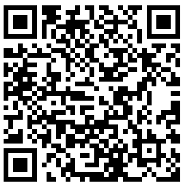
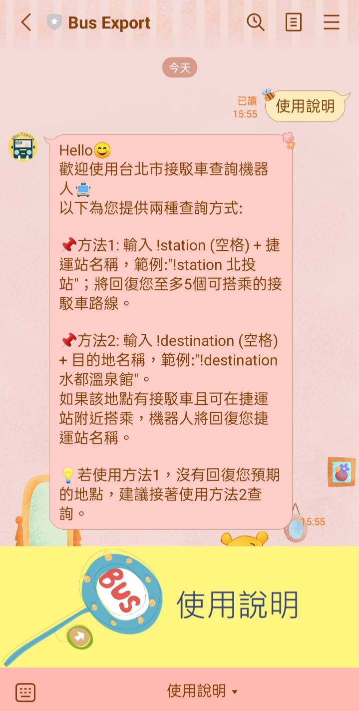
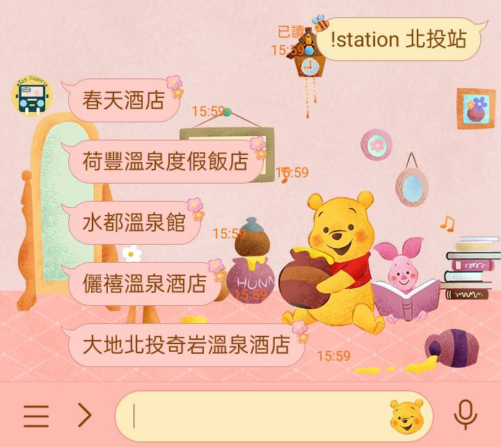

帳號名稱:BusExport
LINE ID: @503sjfnm
LINE QRcode:  
 
##使用指南

* 可以按選單的使用說明，會顯示查詢方法。 

##輸入指令查詢

* 方法1: 以`捷運站名稱`為關鍵字，輸入指定開頭為 !station 空格後加上捷運站名稱，範例:"!station 北投站"；機器人將回復您至多5個可搭乘的接駁車路線。 
 
* 方法2:以`目的地地點`為關鍵字，輸入指定開頭為 !destination 空格後加上目的地名稱，範例:"!destination 水都溫泉館"。 \n如果該地點有接駁車且可在捷運站附近搭乘，機器人將回復您捷運站名稱。 
 
💡若使用方法1，沒有回復您預期的地點，建議接著使用方法2查詢。

##API使用來源

此資料由[臺北大眾捷運股份有限公司-API服務](https://www.metro.taipei/cp.aspx?n=BDEB860F2BE3E249) 所提供

